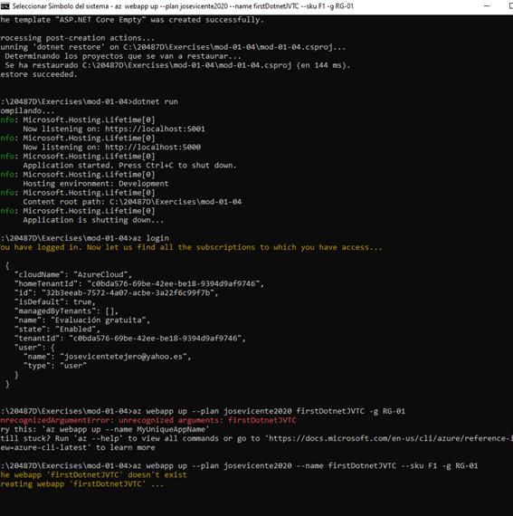
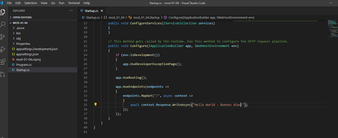
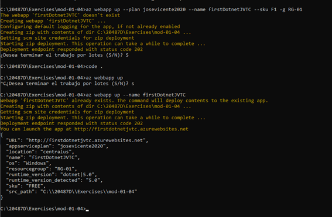
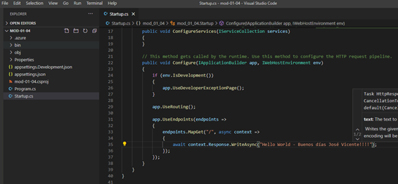
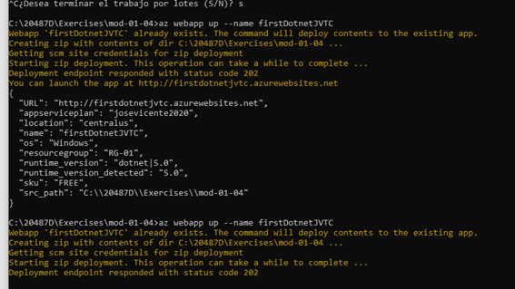
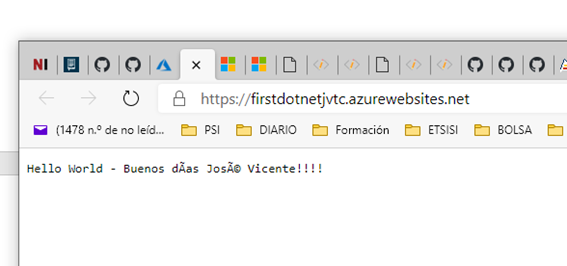

20487D_MOD01

RESULTADO: [https://firstdotnetjvtc.azurewebsites.net](https://firstdotnetjvtc.azurewebsites.net/)

 

 

 

Modificamos en el proyecto creado el mensaje en el Middleware.

 

 

 

Cambiamos el mensaje:

 

 

Lo volvemos a subir.

 

Se ve actualizado.

