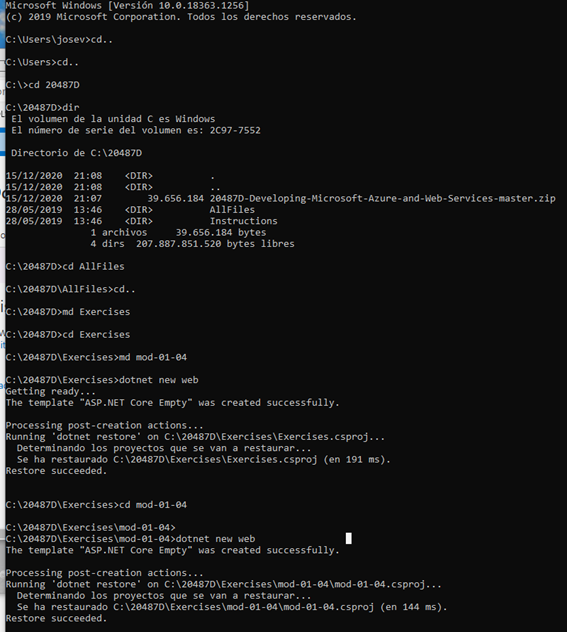
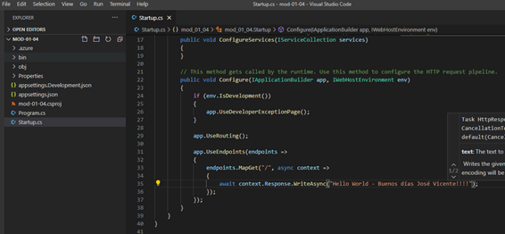

# 20487D_MOD01_DEMO
Module 1: Overview of Service and Cloud Technologies

JOSÉ VICENTE TEJERO - 16/12/2020

RESUMEN
Resultado de la práctica: https://firstdotnetjvtc.azurewebsites.net

En el repositorio hay un fichero word con todos los pasos de la práctica.

PROBLEMAS
No

20487D_MOD01

RESULTADO: [https://firstdotnetjvtc.azurewebsites.net](https://firstdotnetjvtc.azurewebsites.net/)

 

 

 

Modificamos en el proyecto creado el mensaje en el Middleware.

 

 

 

Cambiamos el mensaje:

 

 

Lo volvemos a subir.

 

Se ve actualizado.

